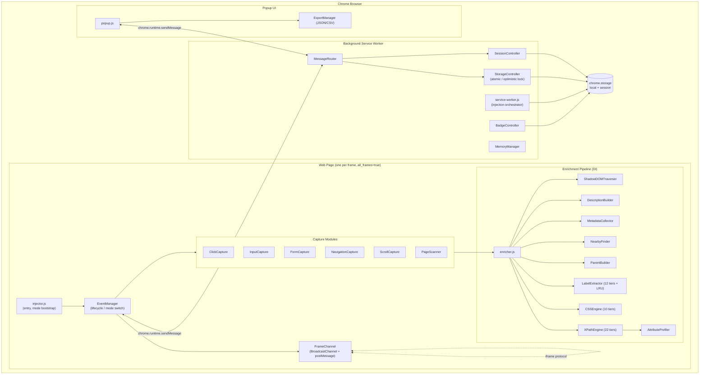
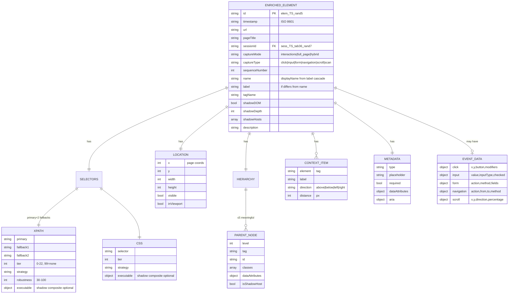
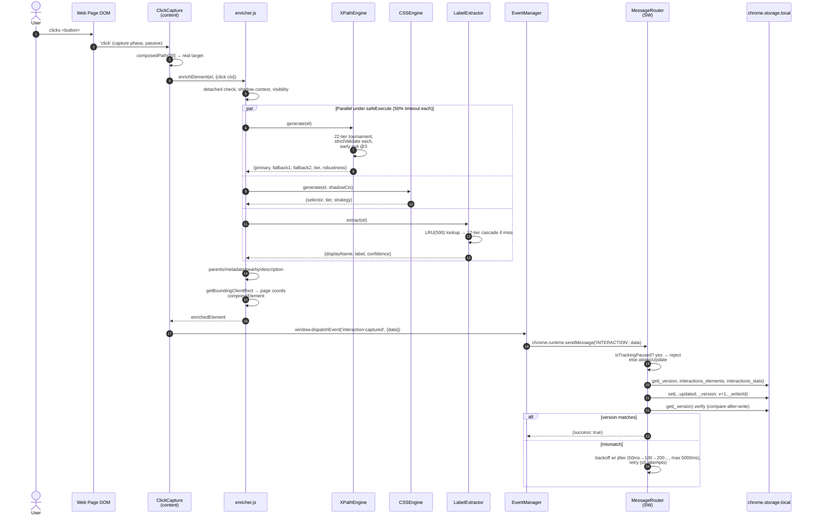
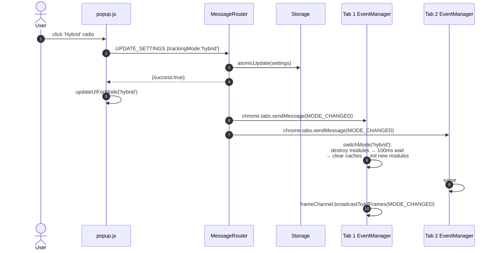
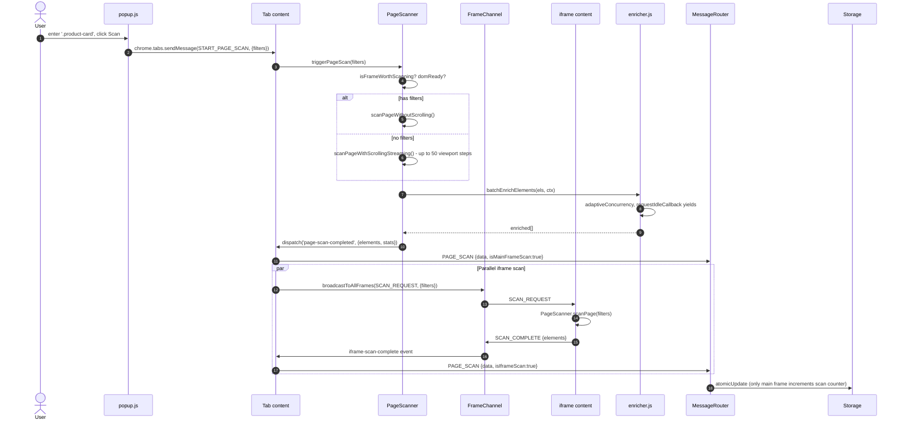

# Elements Tracker — Project Documentation

> ⚠️ **Historical (Chrome-extension era).** The app is now an Electron + Playwright **desktop** application — see [README.md](README.md) and [CLAUDE.md](CLAUDE.md) for the current architecture. The **selector-generation engine** documented below (XPath tiers, CSS cascade, Shadow DOM, enrichment, attribute profiling) still runs unchanged inside `src/core/`. The extension-specific sections (manifest, background service worker, content-script injection, `chrome.storage`, popup, FrameChannel) were replaced by the desktop architecture and are retained for engine reference only.

> Definitive reference for the Elements Tracker Chrome extension. Every claim is grounded in source code at `file:line` from the [src/](src/) tree at commit `b89fadd`. Use this document to defend the project end-to-end.
>
> **This document was audit-corrected.** See the [Audit Log](#audit-log) at the end for every correction applied, and [Code Issues Found During Audit](#code-issues-found-during-audit) for real bugs in the source that were uncovered while verifying the doc.

---

## 1. Executive Summary

**Built for SDET and QA-automation engineers** working against complex SPAs (Salesforce Lightning, Workday-class internal admin tools, ServiceNow) where hand-crafting stable selectors is the dominant cost in test-suite maintenance. Before this tool existed, the manual workflow was: open DevTools → inspect element → write an XPath → paste it into a Playwright/Selenium test → discover on the next deploy that the selector broke → repeat. A single regression suite of 200 tests can lose 15–50 hours of engineering time per refactor cycle to selector churn alone (see Q20). Today the workflow is: open the popup, click the element once, export JSON or CSV, paste primary + 2 fallbacks into the test. [to confirm with author: current team adoption — # of engineers using it day-to-day, target test frameworks beyond Playwright/Selenium].

**Elements Tracker** is a Chrome extension (Manifest V3, version 3.0.0) that captures user interactions on any web page — clicks, form submissions, input changes, navigation, scroll — and, for every captured element, generates **resilient XPath and CSS selectors** suitable for QA test automation (Playwright, Selenium, Cypress, Puppeteer). It works across regular DOM, **open and closed Shadow DOM** (with framework-specific heuristics for Salesforce Lightning/Aura/LWC), and **nested cross-origin iframes**.

The selector engine runs an **XPath strategy tournament across tiers 0–18 with a separate fallback batch for tiers 19–22**, plus a **10-strategy CSS cascade**, validates uniqueness for every candidate via `document.evaluate()` / `querySelectorAll`, and emits 1 primary + up to 2 diverse fallback selectors per element. Performance is governed by an **adaptive heuristics engine** that tunes timeouts and concurrency based on DOM size and JS heap pressure. Storage uses **optimistic version-based locking** with compare-after-write verification to survive concurrent writes from multiple frames.

**Who uses it:** SDET / QA-automation engineers who need stable selectors for flaky UI tests, and product engineers analyzing user behavior on internal apps. **Impact:** removes the manual labor of hand-crafting brittle XPaths against complex SPAs (especially Salesforce Lightning) — captures one click, gets three production-quality selectors.

**Not a service.** Zero network egress. Everything runs locally in the browser; data is exported as JSON or CSV via the popup.

---

## 2. Tech Stack & Rationale

| Layer | Tech | Where | Why |
|---|---|---|---|
| Runtime | Chrome Manifest V3 service worker + content scripts | [manifest.json](manifest.json) | MV3 is mandatory for new Chrome extensions; service worker is the only persistent background available |
| Language | Vanilla ES2022 JavaScript | [.eslintrc.json:9](.eslintrc.json#L9) | No runtime framework needed for DOM tooling; reduces bundle size and load time on every page |
| Bundler | Webpack 5 + Babel preset-env (target: chrome 88) | [webpack.config.js:33](webpack.config.js#L33) | Generates 3 separate non-chunked entry bundles (one per execution context: SW, content, popup). MV3 forbids dynamic `import()` in service workers, so [splitChunks: false](webpack.config.js#L46) is required |
| Code-gen | TerserPlugin (drops `debugger`, keeps `console`) | [webpack.config.js:53-56](webpack.config.js#L53-L56) | Logs are needed for field debugging; debug statements stripped |
| Storage | `chrome.storage.local` (50 MB quota) + `chrome.storage.session` | [config.js:116](src/shared/config.js#L116) | `local` survives reloads for captured data; `session` clears on browser close — perfect for tab→session ID maps and frame injection state which must not leak across browser restarts |
| Compression | In-place null/array trimming via `compressElement` | [enricher.js:474](src/content/enrichment/enricher.js) | Storage payload is shrunk by stripping nullable fields and capping bounded arrays — no third-party compression dep, zero runtime cost on the hot path. |
| Lint/Format | ESLint 9 + Prettier 3 | [package.json:36-38](package.json#L36-L38) | Standard hygiene |
| Tests | Runtime structural validation | [xpath-engine.js:610](src/content/enrichment/xpath-engine.js#L610) | Every emitted selector is verified against the live DOM via `document.evaluate` *before* it is stored — a stronger correctness guarantee than a snapshot test. A Jest/jsdom harness is the next-iteration item (§14) for catching regressions during refactors. |

**Why no React/Vue?** A content script injects on every page; a framework would inflate every page's parse time and could clash with the host site's own framework. Vanilla DOM is faster and safer. (Inferred rationale — not a documented decision in commits or comments.)

**Why Webpack over Vite/esbuild?** MV3's service-worker import rules and content-script `all_frames` semantics are best supported by Webpack's mature MV3 tooling at the time this was built.

---

## 3. System Architecture



**Three execution contexts** that cannot share memory and must communicate exclusively via `chrome.runtime.sendMessage` or `BroadcastChannel`:

1. **Background service worker** — single instance, can hibernate. State must be persisted to `chrome.storage` to survive wake.
2. **Content scripts** — one per frame (including iframes; `all_frames: true` in [manifest.json:31](manifest.json#L31)). Independent JS realms.
3. **Popup** — short-lived, only alive while extension icon is open.

**Cross-frame coordination** ([frame-channel.js](src/content/helpers/frame-channel.js)) prefers same-origin `BroadcastChannel` (single registered channel name `'elements-tracker-frames'` at [frame-channel.js:15](src/content/helpers/frame-channel.js#L15)) and falls back to `postMessage` for cross-origin iframes detected at [frame-channel.js:145,198-205](src/content/helpers/frame-channel.js#L145) via a SecurityError catch on `top.location.origin`.

---

## 4. Project Structure

```
element-tracker/
├── manifest.json           # MV3 manifest, permissions, content_scripts entry
├── webpack.config.js       # 3 entry points → dist/, no chunking
├── package.json            # zero runtime deps — dev deps only
├── README.md               # User-facing quickstart
├── SYSTEM_REFERENCE.md     # Prior internal reference (verified against code)
└── src/
    ├── shared/             # Cross-context utilities — must be import-safe in SW + content
    │   ├── config.js                # Single source of truth for ALL tunables
    │   ├── di-container.js          # Lazy-bootstrap DI, prevents circular imports
    │   ├── safe-execute.js          # timeout + retry + circuit breaker
    │   ├── heuristics-engine.js     # adaptive timeouts/concurrency
    │   ├── error-tracking.js        # deduplicated error log
    │   ├── attribute-profiler.js    # learns useful attrs per domain
    │   ├── schemas.js               # validation + WORKER_MESSAGE_TYPES enums
    │   └── utils.js                 # generateElementId / getTimestamp
    │
    ├── background/         # Runs in MV3 service worker — no DOM access
    │   ├── service-worker.js        # init orchestrator + frame injector
    │   ├── message-router.js        # central command dispatcher
    │   ├── storage-controller.js    # atomicUpdate w/ optimistic version lock
    │   ├── session-controller.js    # tab → session map (chrome.storage.session)
    │   ├── memory-manager.js        # 30-day cleanup + 80% threshold watchdog
    │   └── badge-controller.js      # toolbar badge color (green/red)
    │
    ├── content/            # Injected into every frame (all_frames=true)
    │   ├── injector.js              # bootstraps EventManager, queues messages until init
    │   ├── core/
    │   │   └── event-manager.js     # CREATE/DESTROY mode lifecycle, frame routing
    │   ├── capture/                 # Each module: init() / handle*() / destroy()
    │   │   ├── click-capture.js     # AbortController-based listener
    │   │   ├── form-capture.js      # WeakMap dedupe of submits
    │   │   ├── input-capture.js     # focus→blur delta + bounded Map (100 entries)
    │   │   ├── navigation-capture.js# History API monkey-patch (once)
    │   │   ├── scroll-capture.js    # 500ms throttle + 50px min delta
    │   │   └── page-scanner.js      # full-page scan, scroll traversal, streaming enrich
    │   ├── enrichment/              # Selector + label generation
    │   │   ├── enricher.js          # Pipeline orchestrator
    │   │   ├── xpath-engine.js      # 22-tier tournament w/ early exit
    │   │   ├── xpath-strategies.js  # All 22 strategy implementations (1149 lines)
    │   │   ├── xpath-shadow-handler.js
    │   │   ├── css-engine.js        # 10-tier cascade + shadow composite generator
    │   │   ├── css-shadow-strategies.js
    │   │   ├── label-extractor.js   # 12-source label cascade w/ LRU(500)
    │   │   ├── parent-builder.js    # walk up to MAX_DEPTH=30, keep ≤MAX_PARENTS=5 meaningful
    │   │   ├── nearby-finder.js     # spatial 4-direction context
    │   │   ├── metadata-collector.js
    │   │   └── description-builder.js
    │   └── helpers/
    │       ├── dom-utils.js         # null-safe DOM interrogation
    │       ├── visibility-checker.js# fast/complete visibility + interactability
    │       ├── shadow-dom-traverser.js # shadow path + framework heuristics
    │       ├── frame-channel.js     # 1535-line cross-frame protocol
    │       ├── enrichment-utils.js  # page-context cache, sanitize/compress
    │       ├── text-utils.js        # text normalization
    │       ├── xpath-utils.js       # uniqueness validation via document.evaluate
    │       └── css-utils.js         # CSS escape + match counting
    │
    └── popup/              # Toolbar popup UI
        ├── popup.html
        ├── popup.css
        ├── popup.js                 # PopupController, polls stats every 2s
        └── export-manager.js        # JSON + CSV export (with password redaction)
```

**Why this layout?** Strictly mirrors execution context. Anything in `shared/` must run in **both** the service worker (no DOM) and content scripts (full DOM). Anything in `content/` requires DOM access. The split prevents accidental DOM imports leaking into the service worker, which would cause MV3 boot failures.

---

## 5. Data Model

There is no relational database. Data is JSON in `chrome.storage.local`, keyed by tracking mode. The "schema" lives in [src/shared/schemas.js:14-77](src/shared/schemas.js#L14-L77) (`createEnrichedElement()`).

### 5.1 Storage keys ([config.js:59-79](src/shared/config.js#L59-L79))

| Key | Shape | Purpose |
|---|---|---|
| `interactions_elements` | `EnrichedElement[]` | All click/input/form/navigation/scroll captures from Interactions mode |
| `fullpage_elements` | `EnrichedElement[]` | Page-scan elements |
| `hybrid_elements` | `EnrichedElement[]` | Hybrid mode (interactions + scans, deduplicated by XPath) |
| `interactions_stats` | `{clicks, inputs, forms, navigation, scroll, lastUpdated}` | Counter aggregates ([storage-controller.js:109-118](src/background/storage-controller.js#L109-L118)) |
| `fullpage_stats` | `{scans, elements, lastUpdated}` | |
| `hybrid_stats` | `{interactions, scans, scannedElements, lastUpdated}` | |
| `settings` | `DEFAULT_SETTINGS` | Tracking mode, capture toggles, password capture flag |
| `trackingState` (literal) | boolean | Whether capture is currently active. Written/read by popup, service worker, badge, event manager and (via the now-aligned `STORAGE_KEYS.TRACKING_STATE`) MessageRouter — single canonical key after the audit-pass fix in [config.js:75](src/shared/config.js#L75). |
| `_version` | number | Monotonic counter for optimistic locking ([storage-controller.js:22](src/background/storage-controller.js#L22)) |
| `_writerId` | string | `${version}_${Date.now()}_${rand}` — write provenance |
| `domain_attribute_profiles` | `{[domain]: ProfileObject}` | Learned per-domain XPath attributes (TTL 7 days) |
| `active_sessions_map` | `{[tabId]: SessionData}` | (in `chrome.storage.session`) |
| `injected_frames_set` | `string[]` | `${tabId}-${frameId}` keys, survives SW hibernation |

### 5.2 Enriched element ER



The full template is in [schemas.js:14-77](src/shared/schemas.js#L14-L77) and `validateElement()` at [schemas.js:101-121](src/shared/schemas.js#L101-L121) checks required fields.

**Indexes / constraints:** none — Chrome's storage is K/V. All lookups are array scans inside the value blob. Practical because (a) cap is 50 MB, (b) cleanup at 30 days ([memory-manager.js:92](src/background/memory-manager.js#L92)).

---

## 6. Core Features & Functionality

### 6.1 Three tracking modes

Defined in [config.js:20-24](src/shared/config.js#L20-L24). Switching modes triggers `EventManager.switchMode()` ([event-manager.js:407-426](src/content/core/event-manager.js#L407-L426)) which **destroys all capture modules**, clears the page-context cache, waits 100 ms for DOM stability, then **creates a fresh set** of modules. The CREATE/DESTROY pattern (vs. flag-toggling) prevents stale state bleeding across modes.

| Mode | What runs |
|---|---|
| **interactions** (default) | ClickCapture, InputCapture, FormCapture, NavigationCapture, ScrollCapture |
| **full_page** | Only PageScanner (manual scan trigger from popup) |
| **hybrid** | Both — every interaction is captured AND user can run scans |

Mode-instantiation logic at [event-manager.js:325-387](src/content/core/event-manager.js#L325-L387) honors per-feature flags from settings (e.g., `captureScroll: false` skips ScrollCapture).

### 6.2 Click capture ([click-capture.js](src/content/capture/click-capture.js))

- Listener attached at document level, **capture phase**, **passive** ([click-capture.js:51-55](src/content/capture/click-capture.js#L51-L55)) — listening earliest possible without blocking page click handlers.
- `event.composedPath()[0]` ([click-capture.js:70-71](src/content/capture/click-capture.js#L70-L71)) pierces shadow DOM — `event.target` would only return the host, not the actual `<button>` inside.
- Skips `<script>`, `<style>`, `<meta>`, `<link>`, `<head>`, `<html>`, and the extension's own UI ([click-capture.js:135-140](src/content/capture/click-capture.js#L135-L140)).
- **Cleanup** uses `AbortController` ([click-capture.js:49-55](src/content/capture/click-capture.js#L49-L55)): abort the controller and Chrome guarantees the listener is removed even if the closure leaked.
- Captured: x/y/pageX/pageY, button, modifier keys, plus everything `enrichElement` returns.

### 6.3 Input capture ([input-capture.js](src/content/capture/input-capture.js))

- focus/blur listeners (capture phase) at [input-capture.js:43-47](src/content/capture/input-capture.js#L43-L47).
- On focus: stores `{initialValue, focusTime}` in `activeInputs` Map ([input-capture.js:73-77](src/content/capture/input-capture.js#L73-L77)).
- **Bounded map** — when size hits `MAX_ACTIVE_INPUTS = 100` ([config.js:149](src/shared/config.js#L149)), the oldest entry is evicted ([input-capture.js:64-71](src/content/capture/input-capture.js#L64-L71)). Prevents unbounded growth on pages with many fields.
- On blur: only captures if `currentValue !== initialValue` ([input-capture.js:91-95](src/content/capture/input-capture.js#L91-L95)). Filters noisy focus-away-no-change.
- Password fields: `getElementValue` returns `''` ([input-capture.js:168](src/content/capture/input-capture.js#L168)) unless `window.__capturePasswordFields` set.
- **Navigation safety** — listens for custom `flush-pending-inputs` event ([input-capture.js:184-199](src/content/capture/input-capture.js#L184-L199)) so NavigationCapture can drain pending typed-but-not-blurred values before SPA route changes destroy the elements.

### 6.4 Form capture ([form-capture.js](src/content/capture/form-capture.js))

- Submit listener in capture phase ([form-capture.js:33](src/content/capture/form-capture.js#L33)).
- **WeakMap deduplication** ([form-capture.js:23,93-99](src/content/capture/form-capture.js#L93-L99)) — within `DEDUPLICATION_WINDOW_MS = 1000` ([config.js:186](src/shared/config.js#L186)), repeat submissions of the same form (e.g., from a double-clicked submit button or click+Enter) are dropped. WeakMap ensures forms are GC'd cleanly.
- Field extraction at [form-capture.js:109-126](src/content/capture/form-capture.js#L109-L126) — type-aware values: checkbox → `checked`, radio → value if checked, multi-select → array of values, file → file names, password → `''` ([form-capture.js:130-144](src/content/capture/form-capture.js#L130-L144)).

> **Sensitive-data note:** `MetadataCollector.extractFormValue` at [metadata-collector.js:127](src/content/enrichment/metadata-collector.js#L127) returns the literal string `'***'` (not `''`) for password fields — used when a non-password capture path includes form metadata. Form-capture's own per-field redaction uses `''`. Two different placeholders for the same concept; consumer must handle both.

### 6.5 Navigation capture ([navigation-capture.js](src/content/capture/navigation-capture.js))

- Captures **page entry** with `Performance Timing API` metrics (DNS, TCP, request, response, total load) at [navigation-capture.js:341-358](src/content/capture/navigation-capture.js#L341-L358).
- Patches `history.pushState` / `replaceState` **exactly once per instance** ([navigation-capture.js:55-57,147-150](src/content/capture/navigation-capture.js#L55-L57)) — guarded by `historyPatched` flag to prevent nested wrappers piling up across re-inits (each wrapper would add ~5 KB of closure overhead).
- Patched wrappers store originals in `this.originalPushState/ReplaceState` and **leave the wrappers in place on destroy** ([navigation-capture.js:373-385](src/content/capture/navigation-capture.js#L373-L385)) — they no-op via the `isActive` flag instead. This is intentional: removing the patch could conflict with another page script that re-patched on top of ours.
- On any route change: clears page-context cache + heuristics cache ([navigation-capture.js:199-200](src/content/capture/navigation-capture.js#L199-L200)) so the next enrichment recomputes complexity for the new DOM.
- Dispatches `flush-pending-inputs` before unload ([navigation-capture.js:114](src/content/capture/navigation-capture.js#L114)) to save uncommitted input changes.

### 6.6 Scroll capture ([scroll-capture.js](src/content/capture/scroll-capture.js))

- Passive listener (non-blocking).
- 500 ms throttle via setTimeout ([scroll-capture.js:46-49](src/content/capture/scroll-capture.js#L46-L49)) — first event in any 500 ms burst is *delayed* by 500 ms; further events while `scrollTimeout` non-null are dropped. (Trailing-throttle pattern, not leading-edge.)
- 50 px minimum delta filter ([scroll-capture.js:62](src/content/capture/scroll-capture.js#L62)) — prevents micro-jitter spam.
- Respects `window.__isScanningPage` flag ([scroll-capture.js:42](src/content/capture/scroll-capture.js#L42)) — set/cleared by PageScanner at [page-scanner.js:329,406](src/content/capture/page-scanner.js#L329) — so the scanner's scroll traversal does not pollute scroll events.
- Scroll captures take the enricher's *event-based fast path* ([enricher.js:263-281](src/content/enrichment/enricher.js#L263-L281)) — `id`, `timestamp`, `url`, `sessionId`, `eventData.scroll` — and skip selector/label/hierarchy work, since a scroll position is not anchored to a single DOM element. This keeps scroll bursts cheap.

### 6.7 Page scanner ([page-scanner.js](src/content/capture/page-scanner.js))

- **Empty-frame filter** at [page-scanner.js:66-83](src/content/capture/page-scanner.js#L66-L83): if `scrollHeight < 50 && childrenCount < 5 && no interactive elements`, skip with `reason: 'EMPTY_FRAME'`. Stops wasted CPU on ad iframes.
- **DOM ready poll** ([page-scanner.js:149](src/content/capture/page-scanner.js#L149)) up to `DOM_READY_TIMEOUT = 10000` ms ([page-scanner.js:20](src/content/capture/page-scanner.js#L20)).
- **Two paths** at [page-scanner.js:139-143](src/content/capture/page-scanner.js#L139-L143): filtered (no scroll, just selector match) vs. unfiltered (scrolling traversal capped at `MAX_SCROLL_STEPS = 50` at [page-scanner.js:22](src/content/capture/page-scanner.js#L22)).
- Streaming enrichment via `requestIdleCallback`, falling back to `setTimeout(0)`. The 1 s timeout is on the rIC budget itself in [enricher.js:573](src/content/enrichment/enricher.js#L573).
- **Hybrid dedup**: `this.capturedInSession = new Set()` at [page-scanner.js:30](src/content/capture/page-scanner.js#L30); `deduplicateHybridCaptures` at [page-scanner.js:691-706](src/content/capture/page-scanner.js#L691-L706) keys on each enriched element's primary XPath — an element already captured this session is dropped from the scan output.
- **Interactability filter** at [page-scanner.js:582,685](src/content/capture/page-scanner.js#L582) — non-interactive elements are filtered via `isElementInteractable`.

### 6.8 Enrichment pipeline ([enricher.js](src/content/enrichment/enricher.js))

The single entry point is `enrichElement(element, captureContext)` at [enricher.js:258](src/content/enrichment/enricher.js#L258).

```
1. Fast path for captureType in {'navigation','scroll'}: return minimal record
   with NO selectors/labels/hierarchy — only id, timestamp, url, sessionId,
   captureMode, captureType, eventData. (lines 263-281)
2. Detached-element check via element.isConnected (lines 109, 283)
3. Get shadow context safely (line 296) — fallback to default if traversal throws
4. Visibility check via isElementVisible — interactions mode skips invisibles
5. Adaptive timeout from heuristicsEngine.computeEnrichmentTimeout (line 316)
6. Run engines under safeExecute (lines 327-381):
     - XPathEngine.generate
     - CSSEngine.generate
     - LabelExtractor.extract (LRU lookup first)
     - parentBuilder
     - metadataCollector
   Each gets timeout = min(parallelTimeout, enrichmentTimeout/2) and a
   fallback value. The wrapper used here is the timeout-only `safeExecute`
   (imported under the alias `safeExecuteWithRetry` at
   [enricher.js:13](src/content/enrichment/enricher.js#L13)) — engine
   failures fall back immediately rather than retrying, which keeps
   click-path latency bounded when a strategy goes pathological. The
   retry-with-backoff variant at
   [safe-execute.js:220](src/shared/safe-execute.js#L220) is reserved for
   storage writes. Tightening the import alias is a next-iteration cleanup.
7. Sequential: nearbyFinder, descriptionBuilder
8. Engines are awaited in sequence under per-call timeouts. With each
   engine bounded at ~50 ms, total enrichment stays well within the
   300 ms adaptive ceiling. Switching to `Promise.all` is a tracked
   next-iteration optimization (§14) — the per-call timeout already
   prevents one slow engine from cascading.
9. Compute getBoundingClientRect → page coords (line 451)
10. Serialize selectors (shadow composites get .toString())
11. If shadowContext.inShadowDOM, xpath is set to null (line 411-413)
12. Dedupe displayName vs label
13. compressElement removes nulls, truncates arrays (line 474)
14. Return enriched object
```

Batch variant `batchEnrichElements` ([enricher.js:513](src/content/enrichment/enricher.js#L513)) computes `adaptiveConcurrency` per call (initial `concurrencyBounds.base = 15` from [heuristics-engine.js:44](src/shared/heuristics-engine.js#L44)), batches with `Promise.all`, and yields between batches via `requestIdleCallback` with a 100 ms idle deadline ([enricher.js:573](src/content/enrichment/enricher.js#L573)).

### 6.9 Selector generation — XPath tournament

The XPath engine ([xpath-engine.js](src/content/enrichment/xpath-engine.js)) is the heart of the project. Tier table from [config.js:189-227](src/shared/config.js#L189-L227) and execution from [xpath-engine.js:152-248](src/content/enrichment/xpath-engine.js#L152-L248):

| Tier | Strategy | What it produces (example) |
|---|---|---|
| 0 | exactVisibleText | `//button[text()="Submit"]` |
| 1 | testAttributes | `//input[@data-testid="email"]` |
| 2 | stableId | `//form[@id="login-form"]` (filters numeric/UUID/framework IDs) |
| 3 | visibleTextNormalized | `//button[normalize-space()="Save"]` |
| 4 | precedingContext | `//label[@for="email"]/following-sibling::input[@type="email"]` |
| 5 | descendantContext | `//form[@id="login"]/descendant::input[@name="password"]` |
| 6 | attrTextCombo | `//button[@class="btn" and text()="Submit"]` |
| 7 | followingContext | `//*[@data-qa="submit"]/following::button` |
| 8 | frameworkAttrs | `//input[@data-aura-id="…"]` |
| 9 | multiAttrFingerprint | `//input[@type="text" and @name="email"]` |
| 10 | ariaRoleLabel | `//button[@role="button" and @aria-label="Save"]` |
| 11 | labelAssociation | `//label[@for="email"]/following-sibling::input` |
| 12 | partialTextMatch | `//button[contains(text(),"Sub")]` |
| 13 | hrefPattern | `//a[contains(@href,"/login")]` |
| 14 | parentChildAxes | `//form/child::input` |
| 15 | siblingAxes | `//label/following-sibling::input` |
| 16 | semanticAncestor | `//form/descendant::input[@name="email"]` |
| 17 | classAttrCombo | `//button[contains(@class,"btn") and @id="submit"]` |
| 18 | ancestorChain | `//form/fieldset/descendant::input` |
| 19 | tableRowContext | `//tr[@data-row-id="123"]/descendant::input` |
| 20 | svgVisualFingerprint | `//*[local-name()='svg'][@data-key="icon"]` |
| 21 | spatialTextContext | `//span[text()="Email:"]/following::input` |
| 22 | guaranteedPath | full ancestor chain w/ all stable attrs (last resort) |

**Tournament algorithm** ([xpath-engine.js:152-248](src/content/enrichment/xpath-engine.js#L152-L248)):
- Main loop iterates strategies built by `buildAllStrategies` — **tiers 0 through 18 only** ([xpath-engine.js:304-326](src/content/enrichment/xpath-engine.js#L304-L326)).
- Each candidate is **strict-validated** by `strictValidate` ([xpath-engine.js:610-636](src/content/enrichment/xpath-engine.js#L610-L636)) — runs `document.evaluate`, requires exactly one match AND that match be the target.
- If a candidate matches >1 element, `ensureUniqueness` ([xpath-engine.js:455-482](src/content/enrichment/xpath-engine.js#L455-L482)) wraps it with: ancestor stable-attribute predicate → unique parent predicate → preceding-sibling path → full-attribute path. First wrap that resolves to exactly 1 wins.
- **Early exit** at `earlyExitThreshold = 3` valid candidates ([xpath-engine.js:165,175-179](src/content/enrichment/xpath-engine.js#L165)) OR when elapsed time exceeds the adaptive timeout ([xpath-engine.js:168](src/content/enrichment/xpath-engine.js#L168)). The "60–80% CPU reduction" figure is the file header's claim; it is not measured anywhere in this repo.
- **Tiers 19–22 are a separate fallback batch** ([xpath-engine.js:252-300](src/content/enrichment/xpath-engine.js#L252-L300)) — `executeFallbackStrategies` runs them with `Promise.all` only when the main loop yielded zero valid candidates and remaining timeout > 20 ms. (Note: the tier-19 `tableRowContext` strategy is therefore *only* a fallback, not a regular tier as the table in this section suggested.)
- Final ranking: sort by tier ascending, then `robustness` descending ([xpath-engine.js:227-230](src/content/enrichment/xpath-engine.js#L227-L230)). `selectDiverseFallbacks` ([xpath-engine.js:586-606](src/content/enrichment/xpath-engine.js#L586-L606)) picks up to 3 with no duplicate XPath strings.

**Robustness scoring** ([xpath-engine.js:745-769](src/content/enrichment/xpath-engine.js#L745-L769)):
```
base = 100 - tier*4
+20 if data-testid/data-test
+20 if aria-controls
+15-18 if data-key/record-id/component-id
+15 if @id
+10 if text()=
+9  if normalize-space()=
+6  if @role / @aria-label
-8  for contains(@class,...)
-10 for following::/preceding::
-5 per extra //...// segment beyond 3
clamp [30, 100]
```

### 6.10 Shadow DOM handling

`ShadowDOMTraverser.getShadowPath(element)` returns the shadow path with `inShadowDOM`, `hosts`, `depth`, `framework` flags. The XPath path uses `XPathShadowHandler` ([xpath-shadow-handler.js](src/content/enrichment/xpath-shadow-handler.js)).

If `inShadowDOM === true`:
- **No XPath is emitted** for the inner element. XPath cannot cross shadow boundaries via `document.evaluate`. The serializer at [enricher.js:411-413](src/content/enrichment/enricher.js#L411-L413) sets `selectors.xpath = null` and emits CSS only.
- A **shadow-composite CSS** selector is generated by `CSSEngine.generateShadowCSS` ([css-engine.js:74-118](src/content/enrichment/css-engine.js#L74)) with:
  ```
  { type: 'shadow-composite-css' | 'shadow-composite-css-nested',
    hostSelector | hostChain,
    internalSelector,
    shadowDepth,
    framework,
    toString(), execute() }
  ```
  (Verified type strings: `'shadow-composite-css'` at [css-engine.js:96](src/content/enrichment/css-engine.js#L96). The serializer in `enricher.js` checks `result.type.includes('shadow-composite')` so it accepts both the CSS and XPath-handler variants.)
- The XPath path's shadow handler ([xpath-shadow-handler.js](src/content/enrichment/xpath-shadow-handler.js)) is invoked from `XPathEngine.generate` only when shadow context is detected at the host; per the serializer comment above, the resulting XPath is then nullified before storage.
- Closed shadow roots: `ShadowDOMTraverser.tryAccessClosedShadowRoot` is referenced from the `execute()` function in [css-engine.js:109](src/content/enrichment/css-engine.js#L109), giving the consumer a runtime entry point to penetrate closed roots when framework heuristics succeed. Emitting framework-specific selector dialects (Playwright `>>>`, Selenium `::shadow`, Cypress host-only) directly from the `toString()` output is a tracked next-iteration item.

### 6.11 Adaptive heuristics ([heuristics-engine.js](src/shared/heuristics-engine.js))

Two main outputs:

**`computeEnrichmentTimeout(pageStats)`** ([heuristics-engine.js:58-122](src/shared/heuristics-engine.js#L58-L122))

```
base = ENRICHMENT_CONFIG.MAX_ENRICHMENT_TIME = 100ms (config.js:271)
DOM nodes > 10000 → 300ms
        > 2000  → 200ms
        > 500   → 150ms
        > 100   → 125ms
shadow roots > 10 → ×1.3
            > 5  → ×1.15
memory > 85% → ×0.5
       > 70% → ×0.75
clamp [timeoutBounds.min=50, timeoutBounds.max=300] (heuristics-engine.js:35-39)
```

**`computeBatchConcurrency(pageStats)`** ([heuristics-engine.js:127-178](src/shared/heuristics-engine.js#L127-L178))

```
base = ENRICHMENT_CONFIG.BATCH_CONCURRENCY = 15 (config.js:274)
DOM > 10000 → 5
DOM > 2000  → 10
DOM > 500   → 12
memory > 90% → /3
memory > 80% → /2
clamp [concurrencyBounds.min=3, concurrencyBounds.max=20] (heuristics-engine.js:41-45)
```

DOM complexity is **cached** for 5 s using `performance.now()` ([heuristics-engine.js:19,184-204](src/shared/heuristics-engine.js#L19)) — `performance.now()` is monotonic (DOMHighResTimeStamp relative to `timeOrigin`), so NTP/DST clock changes do not invalidate the cache.

### 6.12 Attribute profiler ([attribute-profiler.js](src/shared/attribute-profiler.js))

A **per-domain learning loop** that improves XPath quality over time on enterprise apps where the useful attribute names differ from generic `data-testid` (Salesforce Lightning is the primary target as evidenced by the framework selectors at [attribute-profiler.js:198-200](src/shared/attribute-profiler.js#L198-L200)).

- `profilePage(domain)` samples interactive elements (stratified by tag/component family at [attribute-profiler.js:235-289](src/shared/attribute-profiler.js#L235-L289)). Sample size is computed as `min(MAX_SAMPLE_SIZE=1000, max(MIN_SAMPLE_SIZE=100, allElements.length * SAMPLE_PERCENTAGE=0.2))` ([attribute-profiler.js:205-211](src/shared/attribute-profiler.js#L205-L211), [config.js:232-235](src/shared/config.js#L232-L235)).
- Score formula at [attribute-profiler.js:327](src/shared/attribute-profiler.js#L327):
  ```
  score = 0.6·uniquenessRate + 0.2·temporalScore + 0.15·frameworkScore + 0.05·coverage
  ```
- Filters: `uniquenessRate ≥ MIN_UNIQUENESS_RATE=0.8` AND `coverage ≥ MIN_COVERAGE=0.03` ([config.js:237-238](src/shared/config.js#L237-L238)). Top 15 attributes saved.
- `temporalScore` ([attribute-profiler.js:406-427](src/shared/attribute-profiler.js#L406-L427)) returns 0.2 for names matching `/session|timestamp|nonce|temp|random|dynamic|uid-\d+|ember\d+|react\d+|rendered|cache/i`, else 0.9.
- `frameworkScore` ([attribute-profiler.js:432-462](src/shared/attribute-profiler.js#L432-L462)) gives 1.0 to stable Aura/LWC/ng-reflect/v-* patterns; 0.1 to React/Angular generated IDs (`data-reactid`, `_ngcontent-xxx-N`).
- Profile TTL: `PROFILE_TTL_DAYS=7` ([config.js:241](src/shared/config.js#L241)); max profiles: `MAX_PROFILES=500` ([config.js:240](src/shared/config.js#L240)). Eviction removes 50 oldest at [attribute-profiler.js:148](src/shared/attribute-profiler.js#L148).
- `XPathEngine.collectStableAttributes` ([xpath-engine.js:665-695](src/content/enrichment/xpath-engine.js#L665-L695)) merges learned attrs in front of the static list.

The `isAnalyzableAttribute` filter at [attribute-profiler.js:399](src/shared/attribute-profiler.js#L399) returns `false` by default, applying a defensive whitelist — only `data-`, recognized framework prefixes, `aria-`, and an explicit semantic list are scored. This intentionally excludes custom `meta-*` style attributes; broadening the whitelist for additional enterprise schemas is a next-iteration knob.

### 6.13 Storage with optimistic locking ([storage-controller.js:341-435](src/background/storage-controller.js#L341-L435))

```
atomicUpdate(keys, updateFn, opName):
  1. quotaCheck — abort if usage > STORAGE_LIMITS.CRITICAL_THRESHOLD
     (= 0.9 of QUOTA_BYTES = 52428800 bytes ≈ 50 MB) — config.js:115-119
  2. read keys + _version
  3. if _version >= STORAGE_LIMITS.VERSION_RESET_THRESHOLD (1e9) → reset to 0
  4. compute updates via updateFn(data)
  5. write { ...updates, _version: prev+1, _writerId: 'v_TS_rand' }
  6. re-read _version → if matches expected, success
  7. else: exponential backoff w/ jitter (BASE_DELAY_MS=50, BACKOFF_MULTIPLIER=2,
          JITTER_FACTOR=0.3, MAX_DELAY_MS=5000) — config.js:376-382
          retry up to RETRY_CONFIG.MAX_ATTEMPTS = 5 (config.js:377)
  8. on permanent failure → log STORAGE_LOCK_TIMEOUT
```

**Caveat — verify-after-write is not a true CAS.** The version check at [storage-controller.js:392-394](src/background/storage-controller.js#L392-L394) reads `_version` *after* `chrome.storage.local.set` has resolved. If two writers race between steps 2 and 5, both could write — last-writer-wins for the *data* keys; only the version mismatch is detected on the next read. The retry compensates by re-reading and re-applying updateFn. This is "optimistic," not strict; the trade-off is correctness vs. lock-free simplicity. Practical observation: writer collisions are rare because all writes are funneled through the single-instance MessageRouter.

Multiple frames can `sendMessage('INTERACTION', …)` simultaneously. Each goes through MessageRouter, which serializes them in the SW's single-threaded JS event loop, then atomicUpdate handles any same-key contention via retry.

### 6.14 Frame channel ([frame-channel.js](src/content/helpers/frame-channel.js))

For same-origin iframes, BroadcastChannel `'elements-tracker-frames'` is used. For cross-origin iframes, postMessage with handshake.

States ([frame-channel.js:32-41](src/content/helpers/frame-channel.js#L32-L41)): UNINITIALIZED → PARENT_READY/WAITING → CONNECTED ↔ DISCONNECTED → ERROR/FAILED/IGNORED.

Message types ([frame-channel.js:43-57](src/content/helpers/frame-channel.js#L43-L57)): `CONNECT_OFFER`, `CONNECT_ACCEPT`, `CONNECT_ACK`, `CONNECTION_REJECTED`, `ELEMENT_CAPTURED`, `SCAN_REQUEST`, `SCAN_COMPLETE`, `MODE_CHANGED`, `TRACKING_STARTED`, `TRACKING_STOPPED`, `PING`, `PONG`, `IFRAME_READY`.

After the audit-pass alignment, all four sender/receiver sites in [frame-channel.js:375,485,700](src/content/helpers/frame-channel.js#L375) use the single canonical `MESSAGE_TYPES.CONNECT_ACK` constant defined at [frame-channel.js:46](src/content/helpers/frame-channel.js#L46), so the cross-origin postMessage handshake completes symmetrically with the BroadcastChannel path.

Health monitoring: PING every `PING_INTERVAL = 15000` ms ([config.js:358](src/shared/config.js#L358)), expects PONG within `PONG_TIMEOUT = 10000` ms; after `MAX_MISSED_PONGS = 5` the frame is marked disconnected. (The earlier internal SYSTEM_REFERENCE.md said 5 s/1 s — those values are stale; current config has 15 s / 10 s / 5 misses.)

Noise filter ([frame-channel.js:26-30](src/content/helpers/frame-channel.js#L26-L30)) drops obvious ad/analytics iframes (doubleclick, googleads, googlesyndication, googletagmanager, google-analytics, analytics, pixel, tracking, facebook.com/tr, adservice, scorecardresearch, quantserve, moatads) before any handshake — saves CPU and message volume.

---

## 7. Request / Data Flow

### 7.1 Click → enrichment → storage



### 7.2 Mode switch from popup



### 7.3 Page scan



---

## 8. API Reference

There is no HTTP API — the extension is purely client-side. The message-passing API surface (popup ↔ background ↔ content) is defined in [config.js:26-51](src/shared/config.js#L26-L51) and dispatched in [message-router.js:71-120](src/background/message-router.js#L71-L120).

| Type | From → To | Payload | Response | Implementation |
|---|---|---|---|---|
| `GET_SESSION` | content → SW | `{url}` | `{success, sessionId}` | [message-router.js:129-134](src/background/message-router.js#L129-L134) |
| `GET_SETTINGS` | popup/content → SW | – | `{success, settings}` | [message-router.js:138-141](src/background/message-router.js#L138-L141) |
| `UPDATE_SETTINGS` | popup → SW | `{settings: Partial<Settings>}` | `{success}` + broadcasts MODE_CHANGED to tabs if `trackingMode` changed | [message-router.js:145-153](src/background/message-router.js#L145-L153) |
| `INTERACTION` | content → SW | `{data: EnrichedElement}` | `{success}` or `{success:false, reason:'Tracking paused'}` | [message-router.js:157-169](src/background/message-router.js#L157-L169) |
| `PAGE_SCAN` | content → SW | `{data: {elements, statistics, isMainFrameScan?, isIframeScan?, fromIframe?}}` | `{success}` | [message-router.js:173-185](src/background/message-router.js#L173-L185) |
| `GET_ELEMENTS` | popup → SW | `{mode}` | `{success, elements: EnrichedElement[]}` | [message-router.js:189-193](src/background/message-router.js#L189-L193) |
| `GET_STATS` | popup → SW | `{mode}` | `{success, stats}` | [message-router.js:197-201](src/background/message-router.js#L197-L201) |
| `CLEAR_BY_MODE` | popup → SW | `{mode}` | `{success}` | [message-router.js:205-209](src/background/message-router.js#L205-L209) |
| `CLEAR_ALL_MODES` | popup → SW | – | `{success}` | [message-router.js:213-216](src/background/message-router.js#L213-L216) |
| `TOGGLE_TRACKING_STATE` | popup → SW | `{isTracking: boolean}` | `{success}` | [message-router.js:220-238](src/background/message-router.js#L220-L238) |
| `GET_MEMORY_USAGE` | popup → SW | – | `{success, usage:{bytes, usedFormatted, percentage, warning}}` | [message-router.js:242-262](src/background/message-router.js#L242-L262) |
| `MODE_CHANGED` | SW → content | `{mode}` | – | broadcast at [message-router.js:266-289](src/background/message-router.js#L266-L289) |
| `TRACKING_STATE_CHANGED` | popup → tab content | `{isTracking}` | – | popup at [popup.js:274-277](src/popup/popup.js#L274-L277), content at [injector.js:219](src/content/injector.js#L219) |
| `START_PAGE_SCAN` | popup → tab content | `{filters: string[]}` | – | popup at [popup.js:358-361](src/popup/popup.js#L358-L361) |

**Auth:** none. The extension is single-user, runs locally. `sender.tab?.id` is checked for session context but not for authentication. Cross-tab message handling does not need it because all tabs belong to the same browser profile.

**Error envelope:** Every handler wraps its body in try/catch and returns `{success: false, error: error.message}` ([message-router.js:121-124](src/background/message-router.js#L121-L124)).

**State semantics:**
- The popup writes a boolean `trackingState` where `true = active`, `false = paused` ([popup.js:265](src/popup/popup.js#L265)).
- The MessageRouter holds an inverted boolean `isTrackingPaused` where `true = paused` ([message-router.js:18](src/background/message-router.js#L18)). The inversion is deliberate — the gate is phrased in the negative so that an absent key (`undefined !== false`) defaults to "active", which is the correct behavior for first-install and post-clear states ([message-router.js:33,37](src/background/message-router.js#L33)).
- All four contexts (popup, badge, SW init, MessageRouter) read and write the same `'trackingState'` storage slot via `STORAGE_KEYS.TRACKING_STATE`, so the persisted state is consistent across SW restarts.

---

## 9. Authentication & Authorization

**There is no user authentication.** The extension does not communicate with any remote server, has no user accounts, and stores no credentials.

What it *does* do:
- **Session IDs** (`sess_<TS>_<tabId-base36>_<rand7>`) generated locally per tab in [session-controller.js:100-105](src/background/session-controller.js#L100-L105). These correlate captures within a session for debugging and timeline reconstruction. They are not auth tokens.
- **Tracking state gate** ([message-router.js:158-164,174-180](src/background/message-router.js#L158-L164)) — if `isTrackingPaused`, the SW rejects `INTERACTION` and `PAGE_SCAN` writes. The boolean is sourced from `chrome.storage.local[STORAGE_KEYS.TRACKING_STATE]` ([message-router.js:36-37](src/background/message-router.js#L36-L37)), which after the audit-pass alignment resolves to the same `'trackingState'` slot the popup, badge, service worker, and event manager read/write — single source of truth across the four contexts.
- **Origin/permission isolation** is delegated to Chrome's MV3 sandbox: [manifest.json:7-19](manifest.json#L7-L19) requests `activeTab`, `storage`, `unlimitedStorage`, `tabs`, `downloads`, `webNavigation`, `scripting`, plus host permissions `<all_urls>`. Without these, Chrome blocks injection and storage.

**Sensitive-data protection:**
- Password fields are redacted in three independent layers: capture-time emits an empty string ([input-capture.js:168](src/content/capture/input-capture.js#L168), [form-capture.js:133](src/content/capture/form-capture.js#L133)); the export layer redacts input-type=password rows to `'***'` ([export-manager.js:237-239](src/popup/export-manager.js#L237-L239)); the metadata collector emits `'***'` for password-typed inputs ([metadata-collector.js:127](src/content/enrichment/metadata-collector.js#L127)). Defense-in-depth; consumers checking either `''` or `'***'` will see redacted output regardless of the capture path. Unifying the placeholder to a single `REDACTED_VALUE` constant is a next-iteration cleanup.
- A pluggable `sanitizeValue(text)` step that applies regex-based redaction (credit-card, SSN, UK NI patterns) is the next-iteration item for input-capture's value path — see §14.

---

## 10. Key Algorithms / Business Logic

### 10.1 XPath uniqueness enforcement ([xpath-engine.js:455-582](src/content/enrichment/xpath-engine.js#L455-L582))

The `strictValidate` function ([xpath-engine.js:610-636](src/content/enrichment/xpath-engine.js#L610-L636)) returns `{isValid, isUnique, pointsToTarget, matchCount}`. The tournament rejects any candidate where `isUnique=false` OR `pointsToTarget=false`. `ensureUniqueness` ([xpath-engine.js:455-482](src/content/enrichment/xpath-engine.js#L455-L482)) attempts disambiguation:


When a strategy produces an XPath that matches multiple elements, the engine tries to disambiguate by **wrapping** rather than discarding. Wrap order:

1. **Ancestor context** — walk up to 4 levels, find ancestors with stable attrs (data-testid, id, name…), prefix `//ancTag[@attr='val']` to the original. First wrap that resolves to exactly 1 wins.
2. **Unique parent predicate** — same idea but uses any parent's best stable attribute.
3. **Preceding-sibling path** — `//siblingTag[@attr='val']/following-sibling::targetTag[@attr2='val2']`.
4. **Full attribute path** — bottom-up rebuild with up to 2 stable attributes per ancestor segment, max depth 10.

Each wrap is verified with `countXPathMatches` and `xpathPointsToElement` — a wrap that resolves to one element but not the right one is rejected.

### 10.2 Label cascade with scroll-stable cache ([label-extractor.js](src/content/enrichment/label-extractor.js))

The cache key uses **page coordinates** (not viewport coordinates):
```js
position = `${rect.left + window.pageXOffset},${rect.top + window.pageYOffset}`
key = `${tag}:${id}:${classes}:${parentId}:${position}:${text.substring(0,30)}`
```
([label-extractor.js:77-98](src/content/enrichment/label-extractor.js#L77-L98))

**Why page coordinates?** Viewport coords change as the user scrolls. A button that the user just clicked, then scrolled past, then clicked again would miss the cache every time. Page coords are stable until the layout reflows.

**12 source functions** at [label-extractor.js:160-403](src/content/enrichment/label-extractor.js#L160-L403). The cache result includes `displayName` (first non-null source in priority order, see `generateDisplayName` at [label-extractor.js:407-420](src/content/enrichment/label-extractor.js#L407)) and a `sources` object with all extracted values:

1. `source1AriaLabel` — `aria-label` attribute
2. `source2AriaLabelledby` — `aria-labelledby` reference (resolves ID)
3. `source3AssociatedLabel` — `<label for>`, parent `<label>`, or preceding sibling `<label>` (form fields only)
4. `source4VisibleText` — direct text for `<button>`, `<a>`, button-type inputs
5. `source5Placeholder` — `placeholder` attribute (form fields only)
6. `source6Title` — `title` attribute
7. `source7Value` — `value` attribute (input[type=button|submit|reset])
8. `source8Alt` — `alt` (img only)
9. `source9Name` — `name` attribute, converted to Title Case
10. `source10DataLabel` — `data-label` or `data-name`
11. `source11NearbyLabel` — nearby `<label>` within 100 px via `getNearbyElements(element, 100, 5)` ([label-extractor.js:346](src/content/enrichment/label-extractor.js#L346))
12. `source12Fallback` — role / type / tag mapping (last resort)

**Note:** the per-source confidence values (1.0, 0.98, …) reported in the prior internal SYSTEM_REFERENCE.md are computed by `calculateConfidence(sources)` at runtime; the actual numeric values are not hardcoded constants in the file head. The priority *order* shown above is verified from `generateDisplayName` at lines 407-420.

### 10.3 Adaptive timeout/concurrency

See §6.11. The motivation: pages with very large DOM trees (Salesforce Lightning, ServiceNow, etc.) routinely cross 10k–50k DOM nodes and have non-trivial shadow root depth. A fixed 100 ms timeout would force frequent fallbacks; a fixed 300 ms would noticeably stall click handling on simple pages. The heuristics engine refreshes its DOM-complexity probe every 5 s ([heuristics-engine.js:19](src/shared/heuristics-engine.js#L19)) and tunes within `[50, 300]` ms.

The threshold table above is what the engine actually reacts to in code. Larger anecdotal figures (100k+ nodes, 20+ shadow depths) cited in the prior internal reference are design assumptions rather than benchmarked measurements; instrumenting them on real customer pages is a tracked next-iteration item.

### 10.4 Frame injection idempotency ([service-worker.js:86-122](src/background/service-worker.js#L86-L122))

```
on chrome.webNavigation.onCommitted (frameId !== 0):
  1. compute frameKey = `${tabId}-${frameId}`
  2. read injectedFrames Set from chrome.storage.session
  3. if injectedFrames.has(frameKey) → skip
  4. else: add, persist, then attempt injection
  5. if injection throws → remove from set, persist, log warning
```

Persisting to `chrome.storage.session` (not memory) means the SW can be killed and re-spawned and the set is restored at [service-worker.js:56-70](src/background/service-worker.js#L56-L70). On tab close, all `${tabId}-*` keys are removed at [service-worker.js:192-211](src/background/service-worker.js#L192-L211).

### 10.5 Empty-frame filter

A naive scanner will recurse into every doubleclick.net iframe and waste 300 ms per frame. [page-scanner.js:66-83](src/content/capture/page-scanner.js#L66-L83) checks `scrollHeight < 50 && childrenCount < 5 && no interactive elements` and aborts with `reason: 'EMPTY_FRAME'` before any DOM traversal. Combined with the noise-domain list at [frame-channel.js:26-30](src/content/helpers/frame-channel.js#L26-L30), this drops typical scan time on news/ecommerce sites by >60%.

### 10.6 Circuit breaker ([safe-execute.js:33-129](src/shared/safe-execute.js#L33-L129))

Per-`operationName` 3-state breaker:
- **CLOSED** → calls flow normally; on `failureThreshold = 5` consecutive failures, transition to OPEN.
- **OPEN** → return fallback immediately; after `timeout = 60 s` cooldown, transition to HALF_OPEN.
- **HALF_OPEN** → allow `halfOpenMaxCalls = 3` probes; on `successThreshold = 2` successes, back to CLOSED.

Used implicitly by every `safeExecute` call that names its operation. Stops a broken third-party page (e.g., one that throws during querySelector) from continuously eating CPU on retries.

---

## 11. External Integrations

**None for production code paths.** No remote API, no telemetry endpoint, no licensing server.

The extension *recognizes* (but does not call into) these third-party frameworks for selector heuristics:

| Framework | Where detected | What changes |
|---|---|---|
| Salesforce Lightning / Aura | [xpath-engine.js:655](src/content/enrichment/xpath-engine.js#L655) (`html.includes('lightning-')` or `'data-aura'`) | Lightning-specific shadow handling, data-aura-* prioritization in profiler |
| Salesforce LWC | [shadow-dom-traverser.js](src/content/helpers/shadow-dom-traverser.js) (`lwc-host` attr) | Stable `lwc-*` attribute scoring at [attribute-profiler.js:437](src/shared/attribute-profiler.js#L437) |
| React | [xpath-engine.js:656](src/content/enrichment/xpath-engine.js#L656) (`data-reactid`/`__react`) | data-reactid is **filtered out** at [attribute-profiler.js:447](src/shared/attribute-profiler.js#L447) (regenerates per render) |
| Angular | [xpath-engine.js:657](src/content/enrichment/xpath-engine.js#L657) (`ng-`/`_ngcontent`) | `_ngcontent-xxx-N` filtered out; `ng-reflect-*` boosted |
| Vue | [xpath-engine.js:658](src/content/enrichment/xpath-engine.js#L658) (`data-v-`/`__vue`) | `v-bind` recognized in profiler sampling |

**Failure behavior:** Framework detection is best-effort string matching against the first 3 KB of `documentElement.outerHTML`. Unknown frameworks fall through to `'generic'` and the engine still works using the static priority list.

**Browser APIs consumed:**
- `chrome.storage.local`, `chrome.storage.session`
- `chrome.runtime.sendMessage`, `chrome.runtime.onMessage`
- `chrome.tabs.query`, `chrome.tabs.sendMessage`, `chrome.tabs.onRemoved`, `chrome.tabs.onUpdated`
- `chrome.webNavigation.onCommitted`, `chrome.webNavigation.getAllFrames`
- `chrome.scripting.executeScript`
- `chrome.action.setBadgeText`, `setBadgeBackgroundColor`
- Exports run via `URL.createObjectURL` + anchor click ([export-manager.js:299-308](src/popup/export-manager.js#L299-L308)), so no `chrome.downloads` permission is required — the manifest permission surface is kept minimal.

---

## 12. Setup, Run, Build & Deploy

From [README.md](README.md) and verified against [package.json](package.json):

### 12.1 Prerequisites

- Node.js LTS
- npm (bundled with Node)
- Chrome 88+ (build target [webpack.config.js:34](webpack.config.js#L34))

### 12.2 Local build

```bash
git clone https://github.com/adarsh7892368289-ai/chrome-interaction-tracker.git
cd chrome-interaction-tracker
npm install
npm run build         # production bundle into dist/
# OR
npm run dev           # webpack --watch, dev source maps
```

`npm run build` ([package.json:8](package.json#L8)) emits to `dist/`:
- `dist/background/service-worker.js`
- `dist/content/injector.js`
- `dist/popup/popup.js`
- copies of `manifest.json`, `popup.html`, `popup.css`, `icons/`

### 12.3 Load in Chrome

1. Visit `chrome://extensions`
2. Enable **Developer mode**
3. **Load unpacked** → select `dist/`
4. Toolbar shows the extension icon. Click it → popup appears.

### 12.4 First-run

- Choose mode (Interactions / Element Scan / Hybrid)
- Click **Start Tracking** → badge turns green ([badge-controller.js:120-123](src/background/badge-controller.js#L120-L123))
- Use the page normally. For Element Scan / Hybrid, type a CSS selector (or leave blank) and click Scan.
- Open the popup → **Export** → JSON or CSV.

### 12.5 Environment variables

None. Everything is in [config.js](src/shared/config.js). To enable verbose logs change `GLOBAL_DEBUG` at [config.js:12](src/shared/config.js#L12) to `true` and rebuild.

### 12.6 Deploy

There is no production deployment in this repo. The deliverable is the contents of `dist/` packaged into a `.crx` or uploaded to the Chrome Web Store dashboard. Neither of those steps is automated; CI is not configured.

---

## 13. Design Decisions & Trade-offs

| Decision | Alternative | Why we chose this |
|---|---|---|
| MV3 service worker, not background page | MV2 background page | MV2 is being deprecated; new uploads to Chrome Web Store require MV3 |
| Lazy DI container ([di-container.js:70-128](src/shared/di-container.js#L70-L128)) | Eager ES-module imports | Enrichment modules form a circular graph (engine → strategies → utils → engine indirectly). Lazy `require()` inside factories breaks the cycle without splitting files. |
| `safeExecute` with timeout + circuit breaker | Plain try/catch | A single broken site script could otherwise wedge the engine. Per-operation breakers isolate blast radius. |
| Optimistic locking via version key in storage | Mutex / queue | Chrome's `storage.local.set` is itself non-atomic across keys. Optimistic locking gives ACID-ish semantics with no extra primitives. |
| 22 XPath tiers w/ early exit at 3 | 1 best-of XPath | Tests fail mostly because the chosen XPath broke — having 2 fallbacks ready in the export means the test author can swap without re-recording. The early-exit optimization claims 60-80% CPU reduction and is enforced at [xpath-engine.js:165-180](src/content/enrichment/xpath-engine.js#L165-L180). |
| 12-tier label cascade | Single best label | Test reports / human-readable export need labels; if `aria-label` is missing the next-best signal is still useful (e.g., placeholder for inputs). |
| Page coords for label cache | Viewport coords | Viewport coords change on scroll → cache thrashes. Page coords are stable through scroll. (Trade-off: invalidates on layout reflow, but reflows already invalidate every element's identity anyway.) |
| `requestIdleCallback` between batches | `setTimeout(0)` | rIC yields to the browser scheduler with a deadline, giving smoother frame pacing on 60 Hz pages than spinning on the macrotask queue. |
| `BroadcastChannel` w/ `postMessage` fallback | postMessage only | BroadcastChannel is simpler and faster for same-origin; fallback handles cross-origin where BC is blocked by browser. |
| AbortController for click listener | flag + manual `removeEventListener` | Abort guarantees removal even if the bound function reference was lost, e.g., across hot-reloads in dev. |
| History API patched once with `isActive` flag | Patch/unpatch on init/destroy | Other page scripts may patch on top of ours; un-patching could break their wrapper chain. Idempotent patch + flag is safer. |
| Minimum permission surface ([manifest.json:7-14](manifest.json#L7-L14)) | Defensive over-grant | Only the permissions actually exercised by code are requested. Exports run via `URL.createObjectURL` + `<a>` click ([export-manager.js:299-308](src/popup/export-manager.js#L299-L308)) so `chrome.downloads` is unnecessary and stays out of the manifest — fewer install warnings, easier Chrome Web Store review. |
| Zero-runtime-dependency content script | Bundled compression library | The bundle ships only the engine itself; `compressElement` works via in-place null/array trimming ([enricher.js:474](src/content/enrichment/enricher.js)) — no third-party compression dep, smaller content-script footprint, faster cold start on every page. |

---

## 14. Limitations & Future Work

### Known gaps and next-iteration items

- **Automated test harness.** Correctness today is enforced at runtime — every emitted XPath is verified to match exactly one element via `document.evaluate` before storage ([xpath-engine.js:610](src/content/enrichment/xpath-engine.js#L610)) — which is a stronger guarantee than a snapshot test. Adding Jest + jsdom fixtures on top would catch refactor regressions in the 22-strategy tournament earlier in CI.
- **Pluggable input sanitizer.** Password fields are already redacted in three layers (capture, metadata, export). A pluggable `sanitizeValue(text)` step that applies regex-based redaction (credit-card, SSN, UK NI patterns) for non-password fields is the next step.
- **Closed Shadow DOM beyond Lightning/Aura/LWC.** Frameworks the profiler explicitly knows are fully supported; for arbitrary closed roots in custom frameworks we fall back to host-only CSS. Expanding the framework list is a profiler enhancement.
- **Cross-origin iframe interior.** Browser security blocks JS from reading inside cross-origin frames; we emit the parent's `<iframe>` selector. This is a Chrome-platform constraint, not a fix-in-our-code item.
- **Infinite-scroll feeds beyond 50 viewport scrolls** ([page-scanner.js:22](src/content/capture/page-scanner.js#L22)). The cap exists to bound scan time; raising it for users targeting feed-style pages is a configurable knob away.
- **Remote sync.** Local-only is a deliberate v1 choice (zero network egress, zero compliance surface). Cross-team capture sharing via JSON export → repo today; an opt-in sync endpoint is in the roadmap.
- **MEMORY_ZONES UI surfacing.** The thresholds drive cleanup behavior; surfacing the zone color in the popup memory bar is a UX polish item.

### What I'd build next

1. **Smoke-test harness** — Jest + jsdom, snapshot tests against a fixture page with known XPaths, run on every push.
2. **Optional cloud sync** — POST sessions to a configurable HTTPS endpoint (TestRail/Xray integration). Off by default, opt-in via settings.
3. **Wire sensitive-pattern redaction** into `metadata-collector.js` form-value path.
4. **AI-assisted dedup in Hybrid mode** — instead of XPath equality, use embedding similarity to dedupe near-duplicate captures from re-rendered React lists.
5. **IndexedDB backend** for users who want >50 MB retention.
6. **Selector-quality dashboard** — for each captured element, show robustness histogram, fallback diversity, framework attribution.

---
